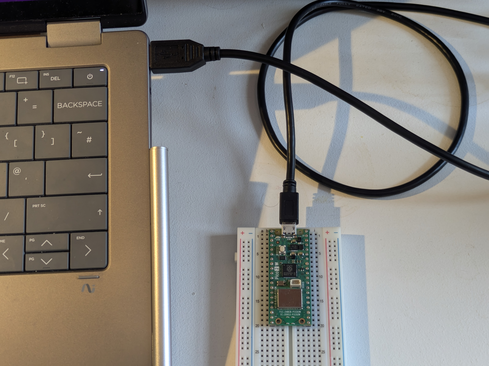

# Setting up Thonny editor
1. Carefully plug the micro USB cable into your laptop and the Pi Pico mounted on the breadboard.

    

2. We need a development environment to write our code in and upload it to the Pico. Download the portable version of Thonny IDE from [this website](https://thonny.org/). If you are on a Uni laptop make sure to download the Portable variant.
Thonny lets us write code in MicroPython (A cutdown version of Python designed to run on microcontrollers).

3. Go into the downloaded folder, double click on the installed file and install the program.

4. At the top of Thonny, click "Run" ➡️ "Configure interpreter...".  
In the window that appears, select "MicroPython (Raspberry Pi Pico)" from the drop down and then click "ok".

    

5. You should now see this at the bottom of your window

    
    
    If you don't see this, your Pi Pico may have no firmware or the wrong firmware. Ask for help or follow [this guide](https://github.com/uos-tinkerlab/installing-firmware-on-pi-pico-2-w) to install the firmware.

