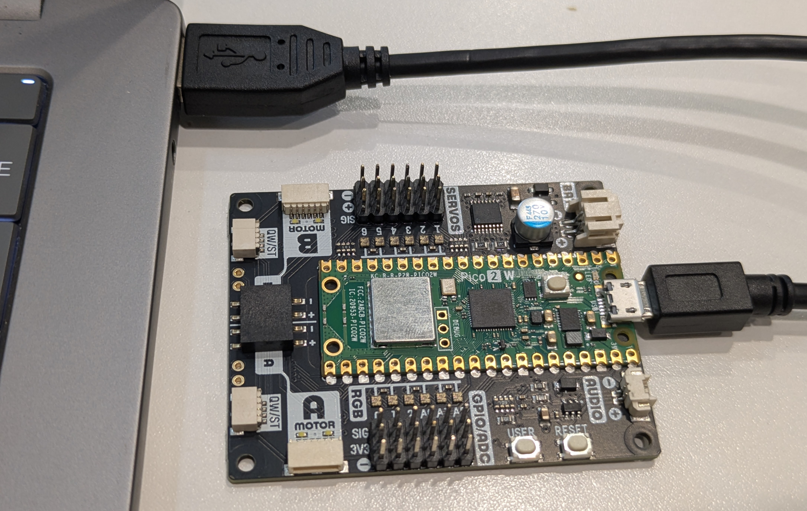
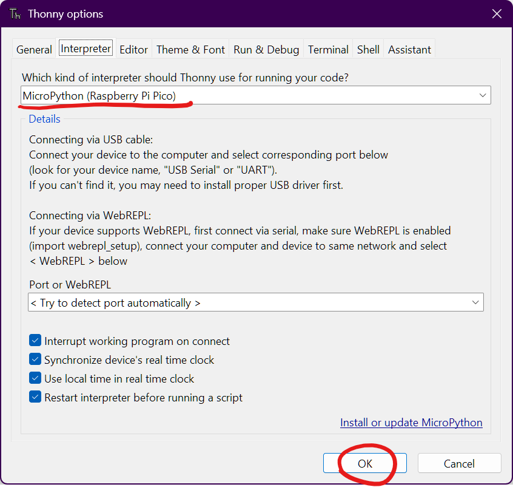
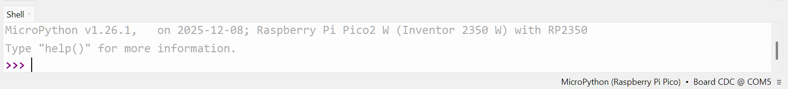

# Setting up Thonny editor
1. Carefully plug the micro USB cable into your laptop and the Pi Pico.

    

2. We need a development environment to write our code in and upload it to the Pico. Download the portable version of [Thonny IDE](https://github.com/thonny/thonny/releases/download/v5.0.0/thonny-5.0.0-windows-portable-x64.zip) which lets us write code in MicroPython (A cutdown version of Python designed to run on microcontrollers).

NEED A WAY OF GETTING THONNEY EDITOR TO THE LAPTOPS FREE EXTRACTED BECAUSE IT TAKES TO LONG 30 MINS TO EXTRACT

3. Go into the downloaded folder, double click "thonny.exe", and then click "Let's go".

4. At the top of Thonny, hover over "Run" and click "Configure interpreter...".  
In the window that appears, select "MicroPython (Raspberry Pi Pico)" from the drop down and then click "ok".

    

5. You should now see this at the bottom of your window

    
    
    If you don't see this, your Pi Pico may have no firmware or the wrong firmware. Ask for help or follow [this guide](../installing-firmware-on-pi-pico-2-w\installing-firmware-on-pi-pico-2-w.md) to install the firmware.

